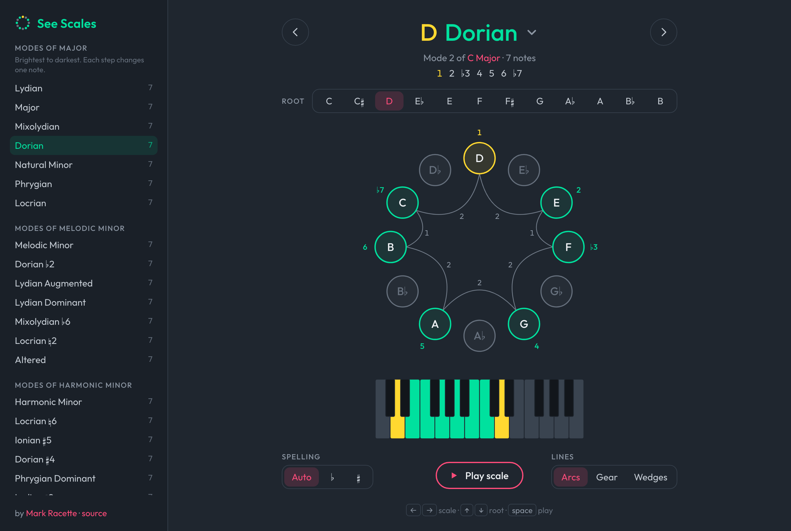

# See Scales

**Live:** https://mracette.github.io/scales

See and hear musical scales on a circle of all twelve notes. Pick a scale and a root, tap notes or the keyboard to hear them, and watch the shape change as you move between scales. The modes of major are ordered brightest to darkest, so each step changes exactly one note.



## Features

- 31 scales: the modes of major, melodic minor and harmonic minor, plus pentatonic, blues and symmetric scales
- Correct note spelling for every key (D major shows F♯, not G♭), with an optional ♭/♯ preference
- Scale degrees on every note, and the parent scale for every mode ("Mode 2 of C Major")
- Three ways to draw the intervals: arcs, gear and wedges
- Shareable links, e.g. [`#/d/dorian`](https://mracette.github.io/scales/#/d/dorian)
- Keyboard shortcuts: <kbd>←</kbd> <kbd>→</kbd> scale, <kbd>↑</kbd> <kbd>↓</kbd> root, <kbd>space</kbd> play

## Development

```sh
npm install
npm run dev     # http://localhost:5173/scales/
npm run check   # lint, test, build
```

Built with Vite, React and TypeScript. Scales are defined as degrees in `src/theory/scales.ts`; spelling and mode logic live in `src/theory/` and are covered by `npm test`.

Pushing to `master` deploys to GitHub Pages through `.github/workflows/deploy.yml`.

Accidental glyphs are a subset of [Noto Music](https://github.com/notofonts/music) (SIL Open Font License).
